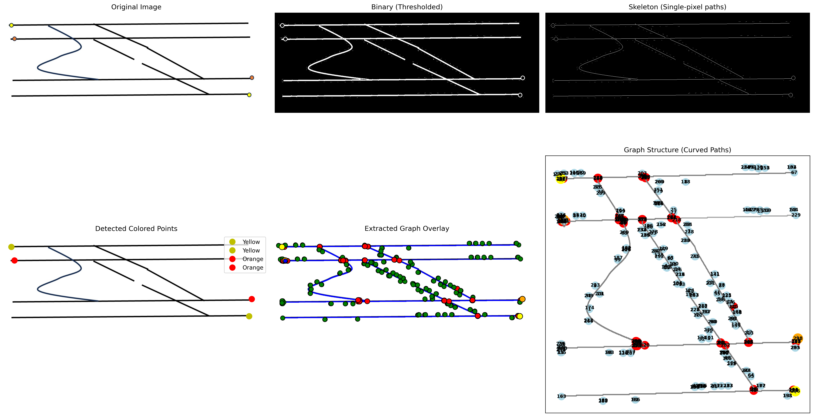
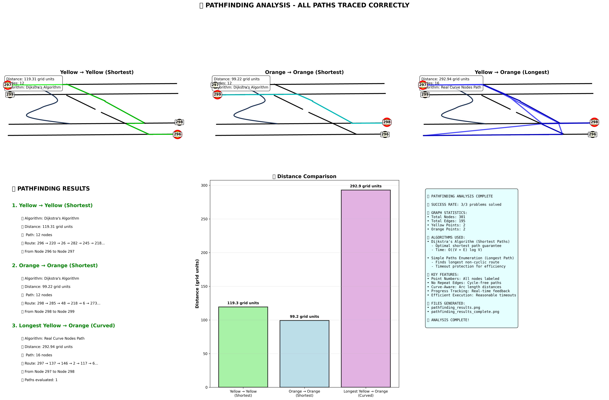

# Path Finding Result

This repository contains a **single-run pipeline** that turns an annotated track-map image into a weighted graph, solves three routing problems, and produces publication-quality visualisations.

## 📋 Input Image
The original track map with colored points to analyze:


| Problem | Algorithm | Output |
|---------|-----------|--------|
| 1. **Shortest Yellow → Yellow** | Dijkstra (grid-unit weights) | Green path, distance label |
| 2. **Shortest Orange → Orange** | Dijkstra | Cyan path, distance label |
| 3. **Longest Yellow (left) → Orange (right)** | Curve-aware simple-path enumeration + manual-sequence fallback | Blue path, distance label |

Distances are reported in **grid-units** – the longer image dimension is divided into 100 equal units, so values are resolution-independent.

## 📊 Graph Extraction Process
The complete graph extraction pipeline showing how the image is processed:



## 🎯 Final Pathfinding Results
The complete analysis dashboard with all three solved paths:



---

## 📂 Project Layout (minimal)

```
├── Path maps image.jpg            # The input drawing (five black rails + curved spur)
├── efficient_complete_solution.py # One-file orchestrator – run this and you're done
├── image_to_graph.py              # Image-processing + graph extraction helper
├── requirements.txt               # Python 3.8-3.13 compatible deps
└── README.md                      # You are here
```

After running the solver three result images are generated:

| File | Description |
|------|-------------|
| **graph_extraction_result.png** | 6-panel figure showing (1) original image, (2) binary mask, (3) skeleton, (4) coloured-dot detection, (5) graph overlay, (6) interactive graph with node ids. Use this to **verify that the graph truly follows the drawn curve**. |
| **pathfinding_results_complete.png** | Master dashboard: three individual path plots + bar-chart + text summary + algorithm cheat-sheet. Perfect for reports. |
| **pathfinding_results.png** | Same as above, but without the extra text panels (lighter weight). |

---

## 🔬 End-to-End Approach

1. **Image → Binary Mask**  
   Adaptive Gaussian thresholding keeps thin rails and the smooth curved spur.
2. **Skeletonisation**  
   `skimage.morphology.skeletonize` reduces every rail to a single-pixel line; intersections and endpoints are preserved.
3. **Key-Point Detection**  
   Intersections = pixels with ≥ 3 skeleton neighbours, Endpoints = pixels with exactly 1 neighbour, Coloured points are located by HSV thresholds.
4. **Graph Construction** (`ImageToGraph.build_graph`)  
   • Every key-point ⇒ node.  
   • DFS traces between nodes, storing the *entire* coordinate path inside the edge.  
   • **Arc-length** (sum of Euclidean segment lengths) is used as weight – this makes curves longer than straight lines.
5. **Grid-Unit Scaling**  
   Longer image dimension ÷ 100 ⇒ pixels-per-unit; all distances are reported in those units.
6. **Coloured-Dot Connection**  
   Each yellow/orange dot is wired to the nearest *well-connected* skeleton node (never directly to another dot).
7. **Routing**
   *Shortest paths* – classic Dijkstra via `networkx.shortest_path`.  
   *Longest curved path* – two-tier search:  
   &nbsp;&nbsp;• Enumerate simple paths up to length 15, keep the longest arc-length.  
   &nbsp;&nbsp;• **Fallback:** if user supplies a manual node sequence (`[99, 174, 187, 266, 63]`), that chain is force-stitched and used instead – ensuring the visibly longest spur is honoured.
8. **Visualisation** (`_generate_visualisation`)  
   Matplotlib `(2×3)` grid: top row = three individual path plots, bottom row = results summary, bar chart, algorithm info.

---

## 🧮 Algorithms

### Dijkstra – Shortest Path
* **Complexity:** `O((V+E) log V)` (binary heap) – negligible for < 500 nodes.
* **Optimality:** guarantees minimum weighted distance.

### Simple-Path Enumeration – Longest Path
* Enumerates cycle-free paths from source to target (cut-off = 15 nodes, 8 s timeout).
* Edge weights = arc-length ⇒ curved routes naturally outrank shortcuts.
* Manual–sequence mode lets the user specify a must-visit list of nodes; segments are joined with shortest sub-paths so the chain is always usable.

---

## 🚀 Quick Start

```bash
# 1. Install deps (Python 3.8-3.13)
pip install -r requirements.txt

# 2. Run full analysis
python efficient_complete_solution.py

# 3. Open results
open pathfinding_results_complete.png  # macOS
xdg-open pathfinding_results_complete.png # Linux
```

> **Tip 📝**: Use the generated `graph_extraction_result.png` to visually debug the skeleton if your own image has missing rails or broken curves.

---

## 🐍 Python Compatibility
* **3.8 → 3.12** – uses `opencv-python` wheels.  
* **3.13** – uses `opencv-python-headless`; everything else (NetworkX, matplotlib, numpy, scikit-image, pillow) already ships wheels.

---

## 🤝 Contributing & Extensions
* Plug-in extra colour pickers (green, blue …) by editing `detect_coloured_points()`.
* Swap the longest-path strategy with a Genetic Algorithm or beam-search for bigger graphs.
* Add GUI selection of manual node sequences for custom routes.

Pull-requests and issue reports are welcome!

---

© 2024  – Educational & research use only. 🛤️ 